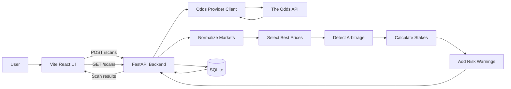

# EPL Odds Scanner

An on-demand scanner for finding potential arbitrage opportunities on Premier League football markets.

## Version 1 Scope

Version 1 focuses on a reliable manual scanner before adding scheduled monitoring, alerts, or exchange data.

### Included

- Pull current Premier League odds on demand.
- Use The Odds API as the initial odds provider.
- Normalize odds across bookmakers into canonical events, markets, outcomes, and lines.
- Compare the best available price for each outcome.
- Detect arbitrage where the implied probability total is under 100%.
- Show stake sizing for a user-entered bankroll.
- Show locked profit, bookmaker names, timestamps, and risk warnings.
- Persist scan runs and results in SQLite.

### Initial Markets

- Match winner.
- Over/under 2.5 goals.

BTTS is still a target market, but it is not part of the core EPL `/odds/` feed currently used by Version 1 live scanning. Add it when the provider plan/endpoint supports soccer additional markets for EPL.

### Deferred

- Betfair exchange integration.
- Betfair commission and liquidity handling.
- Draw no bet.
- Asian handicap.
- Alternate goal lines.
- Scheduled scans.
- Alerts.
- User accounts.
- Historical reporting.

## Product Design

The first screen should be the scanner itself, not a marketing page.

Core views:

- Scan controls: competition, market filters, bookmaker filters, and a refresh action.
- Opportunities table: match, market, outcomes, best prices, bookmakers, implied probability, profit margin, and last updated time.
- Opportunity detail panel: stake split, expected return, locked profit, source links, and warnings.
- Market comparison view: best available prices per fixture even when no arbitrage exists.

## Arbitrage Logic

Odds should be converted to decimal odds before calculation.

For each outcome:

```txt
implied_probability = 1 / decimal_odds
```

For a complete market:

```txt
market_total = sum(implied_probability for all outcomes)
```

An arbitrage opportunity exists when:

```txt
market_total < 1
```

The margin is:

```txt
margin = 1 - market_total
```

For a chosen bankroll:

```txt
stake_i = bankroll * (1 / odds_i) / market_total
```

Expected return should be approximately equal for every outcome:

```txt
return_i = stake_i * odds_i
locked_profit = return_i - bankroll
```

## Architecture

Version 1 uses a simple split application:

- Frontend: Vite, React, and TypeScript.
- Backend: Python, FastAPI, and Pydantic.
- Database: SQLite.
- Database access: SQLAlchemy and Alembic.
- HTTP client: httpx.
- Tests: pytest for backend logic and Vitest for frontend behavior when needed.

The frontend should stay thin. It is responsible for scan controls, loading states, tables, and detail panels. The backend owns odds fetching, normalization, arbitrage detection, stake sizing, persistence, and risk checks.

System diagram:



Recommended repo shape:

```txt
backend/
  app/
    main.py
    config.py
    db.py
    api/
      health.py
      scans.py
    odds/
      the_odds_api.py
      models.py
    normalization/
      markets.py
      teams.py
    arbitrage/
      calculator.py
      staking.py
      risk_checks.py
    storage/
      schema.py
      repositories.py
  tests/

frontend/
  src/
    api/
    components/
    pages/
    types/
```

Main modules:

- `odds`: fetch raw odds from The Odds API.
- `normalization`: map provider-specific events, markets, outcomes, and lines into canonical values.
- `best_prices`: select the best available price per canonical outcome.
- `arbitrage`: calculate implied totals and identify opportunities.
- `staking`: calculate stake sizing and locked profit.
- `risk_checks`: flag stale odds, missing outcomes, line mismatches, and incomplete markets.
- `storage`: persist scan runs, odds prices, and opportunities in SQLite.

Initial API endpoints:

- `GET /health`: confirm the backend is running.
- `POST /scans`: run a new on-demand scan.
- `GET /scans`: list previous scan runs.
- `GET /scans/{scan_id}`: return one scan and its results.

## Backend Development

Start with the backend and test it directly with Postman or curl before building the frontend.

### First-Time Setup

From the repo root, create the virtual environment and install dependencies:

```powershell
cd backend
python -m venv .venv
.\.venv\Scripts\Activate.ps1
python -m pip install -e ".[dev]"
```

### Start Backend

From `backend/`:

```powershell
.\.venv\Scripts\python.exe -m uvicorn app.main:app --host 127.0.0.1 --port 8000 --reload
```

The API runs at:

```txt
http://localhost:8000
```

FastAPI also exposes interactive docs:

```txt
http://localhost:8000/docs
http://localhost:8000/redoc
```

### Stop Backend

If the backend is running in the current terminal, press `Ctrl+C`.

If it is running in the background, find and stop Uvicorn:

```powershell
Get-CimInstance Win32_Process | Where-Object { $_.CommandLine -like '*uvicorn*app.main:app*' } | Select-Object ProcessId, CommandLine
Stop-Process -Id <PID>
```

### Restart Backend

Restart after changing `.env.local`, dependencies, or startup code:

```powershell
Stop-Process -Id <PID>
cd "C:\Users\Chris\Documents\My Projects\epl-odds-scanner\backend"
.\.venv\Scripts\python.exe -m uvicorn app.main:app --host 127.0.0.1 --port 8000 --reload
```

### Run Tests

From `backend/`:

```powershell
.\.venv\Scripts\python.exe -m pytest
```

## Local API Reference

### Endpoints

```txt
GET  http://localhost:8000/health
POST http://localhost:8000/scans
GET  http://localhost:8000/scans
GET  http://localhost:8000/scans/1
```

### `GET /health`

Confirms the backend is running.

Example response:

```json
{
  "status": "ok"
}
```

### `POST /scans`

Runs an on-demand scan.

Live mode request:

```json
{
  "bankroll": 100
}
```

Live mode calls The Odds API and requires `THE_ODDS_API_KEY` in `backend/.env.local`.

Demo mode request:

```json
{
  "bankroll": 100,
  "demo": true
}
```

Demo mode uses fixed sample prices and does not call The Odds API.

Common responses:

- `200`: scan completed.
- `400`: missing or invalid local configuration, such as `THE_ODDS_API_KEY`.
- `502`: The Odds API returned an error or unexpected response.

### `GET /scans`

Currently returns an empty scan list until SQLite persistence is wired:

```json
{
  "scans": []
}
```

### `GET /scans/{scan_id}`

Currently returns a placeholder response until SQLite persistence is wired.

### Postman

Postman files live in:

```txt
postman/
```

Use the `EPL Odds Scanner Local` environment. It defines:

```txt
baseUrl=http://localhost:8000
```

## Data Flow

```txt
User clicks Scan
  -> API fetches EPL odds from The Odds API
  -> Raw odds are normalized
  -> Outcomes are grouped by event and market
  -> Best price is selected for each outcome
  -> Complete markets are checked for arbitrage
  -> Stake sizing and warnings are added
  -> Results are returned to the UI
```

## Risk Warnings

The app should clearly warn that apparent arbitrage can fail because of:

- Odds moving before both bets are placed.
- Bookmaker limits or rejected bets.
- Incorrectly matched markets or lines.
- Rule differences between bookmakers.
- Palpable error corrections.
- Suspended or voided markets.
- API latency or stale odds.

Version 1 should display timestamps prominently and avoid presenting opportunities as guaranteed.

## Build Milestones

1. Scaffold the web app.
2. Scaffold the FastAPI backend.
3. Add SQLite schema and Alembic migrations for scan runs and scan results.
4. Add environment configuration for The Odds API.
5. Implement the odds provider client.
6. Implement canonical market normalization for the three Version 1 markets.
7. Implement best-price selection.
8. Implement arbitrage and staking calculations.
9. Build the scanner UI and opportunity detail panel.
10. Add tests for arbitrage math and normalization.
11. Add risk warnings and stale-data handling.

## Environment Variables

Secrets should not be committed to the repo or written directly in this README.

Use `.env.local` for local development:

```txt
THE_ODDS_API_KEY=
THE_ODDS_API_BASE_URL=https://api.theoddsapi.com
ODDS_SPORT_KEY=soccer_epl
ODDS_REGIONS=uk,eu
ODDS_MARKETS=h2h,totals
DATABASE_URL=sqlite:///./epl_odds_scanner.db
```

Commit an `.env.example` file with variable names only, so the required configuration is documented without exposing real credentials.

Additional provider configuration can be added when Betfair support is introduced.
